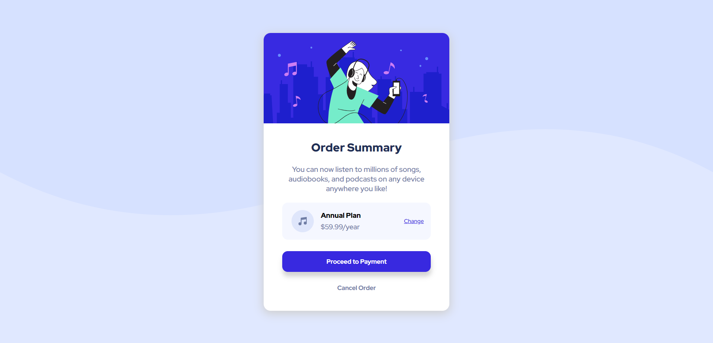

# Frontend Mentor - Order summary card solution

This is a solution to the [Order summary card challenge on Frontend Mentor](https://www.frontendmentor.io/challenges/order-summary-component-QlPmajDUj). Frontend Mentor challenges help you improve your coding skills by building realistic projects. 

## Table of contents

- [Overview](#overview)
  - [The challenge](#the-challenge)
  - [Screenshot](#screenshot)
  - [Links](#links)
- [My process](#my-process)
  - [Built with](#built-with)
  - [What I learned](#what-i-learned)
  - [Continued development](#continued-development)
  - [Useful resources](#useful-resources)
- [Author](#author)


## Overview

### The challenge

Users should be able to:

- See hover states for interactive elements

### Screenshot




### Links

- Solution URL: [Add solution URL here](https://your-solution-url.com)
- Live Site URL: [Add live site URL here](https://your-live-site-url.com)

## My process

### Built with

ONLY
- Semantic HTML5 markup
- CSS custom properties


### What I learned

learn to use hover and these two properties transform: & transition:
```html
<h1>i used this properties in</h1>
```
```css
button{
    transition: 0.5s;
}

button:hover {
    transform: scale(1.05);
}
```

### Continued development

For Now No 
But Why Not!

### Useful resources

- [:hover](https://developer.mozilla.org/en-US/docs/Web/CSS/:hover) - This helped me in hover. I really liked this pattern and will use it going forward.
- [transition](https://developer.mozilla.org/en-US/docs/Web/CSS/transition) - This is an amazing article which helped me to understand this property. I'd recommend it to anyone.


## Author

- Website - working on it
- Frontend Mentor - [@AmrEwais](https://www.frontendmentor.io/profile/AmrEwais)
